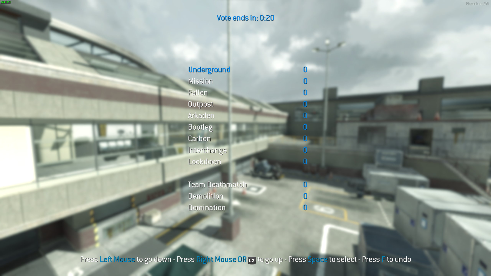
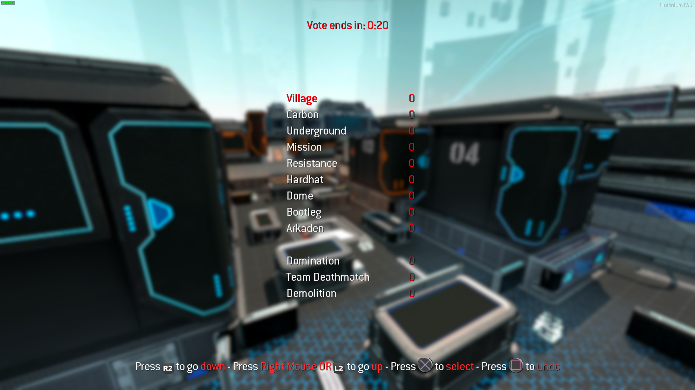

# Mapvote

A customizable mapvote script for the multiplayer mode of Modern Warfare 3.

This works for both custom games and dedicated servers.  

This is heavily inspired by [LastDemon99's IW5 mapvote](https://github.com/LastDemon99/IW5_VoteSystem).  
Huge thanks to him.


*Mouse and keyboard input. Changed settings: horizontal spacing: 100*


*Controller input. Custom map. Changed settings: red colors, accent mode: max*

## mapvote.gsc

### Main features

- It allows up to 12 elements (maps + modes) to be displayed on screen
- You can configure how much maps and modes you want on screen
- It will automatically adapt the amount of elements to display if you don't choose a fixed amount of maps/modes to show
- It has separate map and mode choices
- It supports custom maps
- It supports custom display names for maps
- It supports custom DSR
- It supports custom gamemode names
- It rotates a random map from the list when there are no votes for maps. Same applies for modes too
- You can choose to rotate a random map and mode from a list you define when the human players count is between a min and max values you define (disabled by default)
- Controllers are fully supported and work out of the box
- It has a good level of customization
- It has a debug mode to quickly preview the menu and print some values in the console

### Getting started

To configure the menu before putting it on your server I recommend running it in a custom game with the `mapvote_debug` dvar set to `1`.  
To do that use this command in the console `set mapvote_debug 1` before running a custom game.  
Start a custom game and you will see the menu.  
You can then configure the dvars directly in your console and restart the map with `map_restart` in the console to edit the menu quickly and get your perfect setup.

Note that by default the mapvote will be activated on all of your servers.  
If you run multiple servers and want it off on certain servers you will need to add `set mapvote_enable 0` in the server's CFG.

### Configuration

Below is an example CFG showing how each dvars can be configured.  
The values you see are the default values that will be used if you don't set a dvar.  

```c
set mapvote_enable 1
set mapvote_maps "Seatown,mp_seatown:Dome,mp_dome:Arkaden,mp_plaza2:Bakaara,mp_mogadishu:Resistance,mp_paris:Downturn,mp_exchange:Bootleg,mp_bootleg:Carbon,mp_carbon:Hardhat,mp_hardhat:Lockdown,mp_alpha:Village,mp_village:Fallen,mp_lambeth:Outpost,mp_radar:Interchange,mp_interchange:Underground,mp_underground:Mission,mp_bravo:Piazza,mp_italy:Liberation,mp_park:Overwatch,mp_overwatch:Black Box,mp_morningwood:Sanctuary,mp_meteora:Foundation,mp_cement:Oasis,mp_qadeem:Terminal,mp_terminal_cls:Decommission,mp_shipbreaker:Off Shore,mp_roughneck:Gulch,mp_moab:Boardwalk,mp_boardwalk:Parish,mp_nola:Favela,mp_favela:Highrise,mp_highrise:Skidrow,mp_nightshift:Nuketown,mp_nuked:Rust,mp_rust" // Default value: Every maps including DLC maps and Plutonium DLC maps (excluding [Face Off maps](https://callofduty.fandom.com/wiki/Face_Off#Modern_Warfare_3))
set mapvote_modes "Team Deathmatch,TDM_default:Domination,DOM_default" // Default value: Team Deathmatch and Domination
set mapvote_additional_maps_dvars ""
set mapvote_limits_maps 0
set mapvote_limits_modes 0
set mapvote_limits_max 12
set mapvote_colors_selected "blue"
set mapvote_colors_unselected "white"
set mapvote_colors_timer "blue"
set mapvote_colors_timer_low "red"
set mapvote_colors_help_text "white"
set mapvote_colors_help_accent "blue"
set mapvote_colors_help_accent_mode "standard"
set mapvote_sounds_menu_enabled 1
set mapvote_sounds_timer_enabled 1
set mapvote_vote_time 30
set mapvote_blur_level 2.5
set mapvote_blur_fade_in_time 2
set mapvote_horizontal_spacing 75
set mapvote_display_wait_time 1
set mapvote_default_rotation_enable 0
set mapvote_default_rotation_maps "mp_dome:mp_nuked:mp_rust"
set mapvote_default_rotation_modes "TDM_default"
set mapvote_default_rotation_min_players 0
set mapvote_default_rotation_max_players 0
```

Here are some pre-set values if you want to quickly copy/paste something

| Description | Value |
|---|---|
| All base game maps | "Seatown,mp_seatown:Dome,mp_dome:Arkaden,mp_plaza2:Bakaara,mp_mogadishu:Resistance,mp_paris:Downturn,mp_exchange:Bootleg,mp_bootleg:Carbon,mp_carbon:Hardhat,mp_hardhat:Lockdown,mp_alpha:Village,mp_village:Fallen,mp_lambeth:Outpost,mp_radar:Interchange,mp_interchange:Underground,mp_underground:Mission,mp_bravo" |
| All DLC maps | "Piazza,mp_italy:Liberation,mp_park:Overwatch,mp_overwatch:Black Box,mp_morningwood:Sanctuary,mp_meteora:Foundation,mp_cement:Oasis,mp_qadeem:Terminal,mp_terminal_cls:Decommission,mp_shipbreaker:Off Shore,mp_roughneck:Gulch,mp_moab:Boardwalk,mp_boardwalk:Parish,mp_nola" |
| All Face Off maps | "Lookout,mp_restrepo_ss:Getaway,mp_hillside_ss:Erosion,mp_courtyard:Aground,mp_aground_ss:Vortex,mp_six_ss:U-Turn,mp_burn_ss:Intersection,mp_crosswalk_ss" |
| All Plutonium DLC maps | "Favela,mp_favela:Highrise,mp_highrise:Skidrow,mp_nightshift:Nuketown,mp_nuked:Rust,mp_rust" |
| Classic modes | "Team Deathmatch,TDM_default:Domination,DOM_default" |
| Objective modes | "Demolition,DD_default:Headquaters,HQ_default:Capture the Flag,CTF_default" |
| Alternative modes | "Kill Confirmed,KC_default:Team Defender,TDEF_default:Sabotage,SAB_default:Drop Zone,DZ_default" |
| Party modes | "Gun Game,GG_default:One in the Chamber,OIC_default" |
| Juggernaut modes | "Juggernaut,JUG_default:Team Juggernaut,TJ_default" |
| FFA 24/7 | "Free for All,FFA_default" |
| SND 24/7 | "Search & Destroy,SD_default" |
| Infected 24/7 | "Infected,INF_default" |

### Dvars

Here are the dvars you can configure:

| Name | Description | Accepted values |
|---|---|---|
| mapvote_enable | Toggle whether the mapvote is activated or not. 0 is off and 1 is on | 0 or 1 |
| mapvote_debug | Toggle whether the mapvote runs in debug mode or not. This will display the mapvote menu a few seconds after starting the game. 0 is off and 1 is on | 0 or 1 |
| mapvote_maps | A list of the maps that are available for rotation | Any text followed by a comma (,) and then the map code name (mapname). Each block is separated with a colon (:). A single space `" "` is also accepted if you don't want any maps for this dvar |
| mapvote_modes | A list of the modes that are available for rotation. The first parameter is how the mode will be displayed, it can be set to anything you like, the second parameter is the name of the DSR file to load | Any text followed by a comma (,) and then the cfg name. Each block is separated with a colon (:) |
| mapvote_additional_maps_dvars | A list of dvar name(s) that contain additional maps, respecting the `mapvote_maps` format.  See [Adding a custom map](#adding-a-custom-map) | Any valid dvar name that has a list of maps as value. Each dvar name is separated with a colon (:) |
| mapvote_limits_maps | The amount of maps to display. 0 will handle it automatically | Any plain number from 0 to `mapvote_limits_max` |
| mapvote_limits_modes | The amount of modes to display. 0 will handle it automatically | Any plain number from 0 to `mapvote_limits_max` |
| mapvote_limits_max | The maximum amount of elements to display (maps + modes) | 2, 4, 6, 8, 10, 12 |
| mapvote_colors_selected | The color of the text when hovered or selected. This is also the color of the votes count | red, green, yellow, blue, cyan, purple, white, grey, gray, black |
| mapvote_colors_unselected | The color of the text when not hovered and not selected | red, green, yellow, blue, cyan, purple, white, grey, gray, black |
| mapvote_colors_timer | The color of the timer as long as it has more than 5 seconds remaining | red, green, yellow, blue, cyan, purple, white, grey, gray, black |
| mapvote_colors_timer_low | The color of the timer when it has 5 or less seconds remaining | red, green, yellow, blue, cyan, purple, white, grey, gray, black |
| mapvote_colors_help_text | The color of the help text at the bottom explaining how to use the menu | red, green, yellow, blue, cyan, purple, white, grey, gray, black |
| mapvote_colors_help_accent | The color of the accented text of the help text at the bottom | red, green, yellow, blue, cyan, purple, white, grey, gray, black |
| mapvote_colors_help_accent_mode | The accenting mode for the help text. `standard` only puts the accent color on the button to press and `max` puts it on both the buttons and the action it does | standard or max |
| mapvote_sounds_menu_enabled | Toggle whether the mapvote menu sounds are enabled or not. 0 is off and 1 is on | 0 or 1 |
| mapvote_sounds_timer_enabled | Toggle whether the timer will start making a beeping sound every second when there's 5 or less seconds remaining to vote or not. 0 is off and 1 is on | 0 or 1 |
| mapvote_vote_time | The time the vote lasts (in seconds) | Any plain number above 5 |
| mapvote_blur_level | The amount of blur to put when the mapvote menu starts to show. The max recommended value is 5. 0 disables it | Any number |
| mapvote_blur_fade_in_time | The time (in seconds) it takes for the blur to reach `mapvote_blur_level`. For example if you set it to 10 and `mapvote_blur_level` is 5 then it will progressively blur the screen from 0 to 5 in 10 seconds | Any number |
| mapvote_horizontal_spacing | The horizontal spacing between the map/mode names on the left and the vote counts on the right. I recommend setting this value according to the longest map or mode name length so that it doesn't overlap with the vote counts | Any plain number |
| mapvote_display_wait_time | Once the killcam ends, the time to wait before displaying the vote menu (in seconds) | Any number superior or equal to 0.05 |
| mapvote_default_rotation_enable | Toggle whether the default rotation system is activated or not. This allows you to have one or more map(s) and mode(s) rotate by default when the human player count is between `mapvote_default_rotation_min_players` and `mapvote_default_rotation_max_players` 0 is off and 1 is on | 0 or 1 |
| mapvote_default_rotation_maps | A list of the map code names that are available for default rotation | Any map code name. Each map is separated with a colon (:) |
| mapvote_default_rotation_modes  | A list of the DSR file names that are available for default rotation | Any DSR file name. Each DSR file name is separated with a colon (:) |
| mapvote_default_rotation_min_players | The minimum amount of human players required to rotate the default rotation instead of showing the mapvote. If the human players count is smaller than this then it will display the regular mapvote rotation instead | Any plain number from 0 to 18 |
| mapvote_default_rotation_max_players | The maximum amount of human players required to rotate the default rotation instead of showing the mapvote. If the human players count is higher than this then it will display the regular mapvote rotation instead | Any plain number from 0 to 18 |

### Adding a custom map

**[IMPORTANT]** MW3 has a limit of `1024` characters for dvars so the value of `mapvote_maps` cannot be longer than that or it will fail to read it properly.  

For this reason there are ways to add a custom map to your rotation:

#### Adding a custom map the classic way

You can simply add your map normally to `mapvote_maps` while being sure the dvar doesn't have more than `1024` characters.  
So for example, if you wanted to add Scrapyard as a custom map in your rotation `"Seatown,mp_seatown:Dome,mp_dome"` would become `"Seatown,mp_seatown:Dome,mp_dome:Scrapyard,mp_boneyard"`

#### Adding a custom map the advanced way

On the other hand, if `mapvote_maps` is close to having more than `1024` characters or if you want to better organize your custom maps you can use the system I put in place.  

Simply create a dvar with any name you want, for example `mapvote_maps_mw2` and then add maps to it the same way you add maps to `mapvote_maps` and respecting the `1024` characters limit too.  
Finally, add the **name** of this dvar to `mapvote_additional_maps_dvars`.  
So in this example `mapvote_additional_maps_dvars "mapvote_maps_mw2"`.  
The script will then automatically read all values from `mapvote_maps` and `mapvote_maps_mw2`, all your maps will be taken into account for the randomization of available maps.  

You can simply repeat this process to add even more dvars in case you go up to the characters limit again or if you simply want to organize your maps dvars.  
For example you could create an additional dvar named `mapvote_maps_bo2` that holds some maps and then add it to the list of dvars like this `mapvote_additional_maps_dvars "mapvote_maps_mw2:mapvote_maps_bo2"`.  

Note that you can change the value of `mapvote_maps` to a single space `" "` if you don't want any map in this dvar.  
It will then only get maps from the additional dvars and will ignore the original dvar.  
This can be useful to organise your maps dvars.

### Notes

- Capture the Flag is very buggy and will not be fixed. It pretty much breaks the entire mapvote script so I recommend to not add it.  
From the tests I did it seems a lot of things outside of my mapvote break it and I'm not willing to fight with so much unknown bugs coming from the outside
- If right click is set to toggle ads then pressing right click will make the player go up by one every 0.25s until he right clicks again.  
If I didn't change it to be that way players with toggle ads would have to press right click twice to go up by one all the time.  
Now instead they simply right click once to start going up and right click again to stop which is a better user experience.
- When there's only one map/mode, instead of showing a single vote possibility, your single map/mode will be hidden to make the user experience better but it will still always rotate to your one map/mode
- If some map/mode names or vote count don't display at all then you probably have other scripts that create HUD elements and there's too much elements to display so either remove your script or lower `mapvote_limits_max` so that the mapvote will have less elements to display
- When two maps/modes have the same votes, the lowest one in the list will win. In the future it would be nice to randomize between both
- The game doesn't seem to have a way to display the correct key for aiming (whether you use hold to ads or toggle ads) so after trying multiple solutions I decided to simply put both keys on screen. It's not perfect but this ensures the players have all the information to use the menu properly
- Once you enable your controller the game seems to never display the keyboard key again for the `Use` key (Undo). It's a pretty situational/rare bug but it would be nice to find another key or a way to somehow fix it in the future
